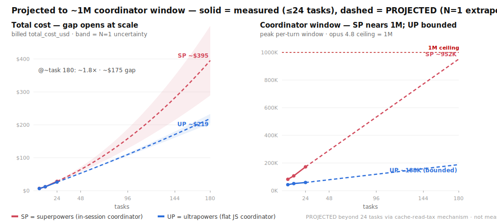

# ultrapowers

ultrapowers takes a goal or a task list and builds it for you, unattended, running the
[Superpowers](https://github.com/obra/superpowers) build discipline by Jesse Vincent
([@obra](https://github.com/obra)). It writes a plan, builds each task test-first, has a second and
stronger model review every task, loops a critic until the goal is actually met, and hands back one
reviewed branch. You step in at two points only: approving the plan up front, and reviewing the
finished branch.

That discipline is Superpowers' work, embedded verbatim: spec-first design, watch-it-fail TDD, and a
two-stage review on every task. ultrapowers' own part is the host. It runs the discipline on a
deterministic JavaScript coordinator, so a long, many-task build runs hands-off without filling up
your chat session. The name and the idea come from a Superpowers proposal obra declined; see
[Why it exists](#why-it-exists).

It runs in Claude Code today, hosted by the Workflow tool. The coordinator is plain JavaScript and
the implementer can already be Claude, Codex, or Gemini, so hosting the coordinator on other agents
is a roadmap goal, not a promise yet.

## What you get



Two numbers, from a model-fair head-to-head against superpowers (same implementer and reviewers on
both sides; the only difference is where the orchestration loop runs):

- **Cost on par.** Within about 6% of superpowers all the way to 24 tasks ($25.95 vs $28.19), at
  equal quality (both finished 24/24 tasks green). There is no per-bill discount at normal sizes.
- **The coordinator stays flat.** Its session context grows about 6× slower (0.8K vs 5K tokens per
  task). superpowers runs the loop in your session, so its window climbs with every task;
  ultrapowers runs the loop in a script, so the build adds almost nothing to the controlling
  session. On a single long goal of hundreds of tasks, that bounded coordinator is what keeps the
  controlling session from filling up as the build grows, and (projected) what makes it cheaper at
  scale. Full numbers and the honest projection caveat are in [Benchmarks](#benchmarks-measured-then-projected).

## Quick start

```
/plugin marketplace add 7xuanlu/claude-plugins
/plugin install ultrapowers@7xuanlu
```
Or install this repo directly (it is its own single-plugin marketplace, also named `7xuanlu`):
```
/plugin marketplace add 7xuanlu/ultrapowers
/plugin install ultrapowers@7xuanlu
```
Start a new session so the SessionStart hook runs (it symlinks the engine into
`~/.claude/workflows/ultrapowers-development.js`). Then:
```
/workflows-driven-development help
/workflows-driven-development "your goal here"
```
If the command does not resolve by name in a freshly installed session, it falls back to
dispatching the engine by `scriptPath` automatically.

**Requirements:** Claude Code with the Workflow tool, and Node (the engine is checked on Node 20;
newer is fine). The default implementer (`claude`) needs no external CLI. The optional `codex` and
`gemini` implementers need those CLIs installed plus a sandbox carve-out; see [Safety](#safety-it-runs-code-unattended).

## What it is

ultrapowers is a Claude Code Workflow (a deterministic JavaScript coordinator) that runs
[Superpowers](https://github.com/obra/superpowers)' SDD/TDD discipline on disposable subagents:

```
goal ─▶ plan
        ⏸ GATE 1: you approve the plan, then walk away
        ─▶ per task (SERIAL):
             implement (cheap model, strict TDD red-green-refactor)
               ─▶ deterministic gate (run the real test suite)
               ─▶ re-witness RED   (strip the impl, prove the test fails without it)
               ─▶ spec review  (capable model, fail-closed, "do not trust the report")
               ─▶ quality review (capable model, fail-closed, YAGNI/anti-gaming)
               ─▶ fix-loop
        ─▶ dry-until-clean critic adds tasks until the goal is met (opt-in)
        ─▶ final adversarial integration review
        ⏸ GATE 2: every finding from the run surfaces to you, before merge
```

The build runs unattended between the two gates. A Workflow takes no mid-run human input, so the
harness never stops to ask. Anything it hits (a failed task, a BLOCKED implementer, gaps the critic
reopened, the integration verdict) is collected and surfaced to you at GATE 2 as a reviewable branch
and a verdict, not a stream of interruptions.

The whole design follows from one fact: **the coordinator is code, not a model turn.**

- **Zero LLM calls in the loop.** The controlling session's context never grows with the build, so
  it cannot compact or overflow; the reasoning happens in subagents.
- **Disposable subagents pay the token cost** once, then are discarded, so heavy context never
  accumulates in your window.
- **Durable state lives in files** (the task list, per-task logs), so the run is crash-resumable and
  is not limited by the controlling session's context.
- **Least-powerful-model routing.** Cheap models implement, capable models review; you do not pay
  top-tier rates for mechanical work.

That is what makes "hand off a whole goal and walk away" actually hold.

## Why it exists

**Most of ultrapowers is Superpowers, and we do not pretend otherwise.** The build discipline it
runs (watch-it-fail TDD, the two-stage fail-closed review, least-powerful-model routing) is
Superpowers' work by Jesse Vincent ([@obra](https://github.com/obra)), embedded verbatim, with
gratitude (see [`NOTICE`](./NOTICE)). Expect the same harness guarantees you would get from
Superpowers on everything it covers, no more and no less.

Superpowers is prompt-driven and in-session by design, and obra has been deliberate about it: asked
whether orchestration should move to an external coordinator, he answered that there is *"a ton of
value in external orchestrators, but moving to that model is dramatically more complicated for most
users"* ([#1041](https://github.com/obra/superpowers/issues/1041)). For Superpowers' broad audience
that is the right call, and we respect it.

The name comes from a proposal Superpowers declined:
[#1647](https://github.com/obra/superpowers/issues/1647), *"a new workflow-driven-development
skill-command … the workflow-native sibling of SDD"*, opened by
[@codename-cn](https://github.com/codename-cn) and closed not-planned by obra as an untested,
agent-authored RFC (*"made up by an agent that didn't even test it"*). That critique is the spec:
ultrapowers is that idea built and tested, hosting the SDD/TDD discipline on Anthropic's
deterministic Workflow primitive, proven by a reproducible re-witness-RED self-test and a measured
benchmark, for the narrower audience that wants to hand off a whole goal and walk away.

So this is complement, not replace: for interactive, human-in-the-loop work use Superpowers, the
parent, which is better at it; ultrapowers is for unattended hand-offs, where it adds a dynamic
loop-until-clean critic and the mechanical re-witness-RED check. Thanks to
[@obra](https://github.com/obra) for the discipline and a principled decline, and to
[@codename-cn](https://github.com/codename-cn) for the original idea.

**What is ours, and what is not.** The flat coordinator is a property of Anthropic's Workflow
primitive, not our invention; our move is choosing to host SDD/TDD on it. It is a scaling property,
not a cost discount: a measured head-to-head (N=5, two small tasks per run) was a tie ($3.90 vs
$4.03 median, ranges fully overlap). Dynamic task-adding critics already exist (CAMEL Workforce,
Magentic-One); ours is novel only in this combination. re-witness RED is the one mechanism we could
not find shipped in any comparable build loop, and it is the headline. The SDD/TDD discipline is
inherited. Detail and sources are in [`docs/research/oss-landscape.md`](./docs/research/oss-landscape.md).

## Where it fits

ultrapowers takes a goal or a plan and gives back a reviewed branch. The plan can come from
anywhere: a Superpowers brainstorming and writing-plans session, some other planning tool, or a raw
goal you hand it and let it decompose.

```
any goal or plan ─▶ UP /workflows-driven-development ─▶ reviewed branch + GATE 2 verdict ─▶ your merge step
 (e.g. SP brainstorming      (build it, unattended,                                           (e.g. SP
  + writing-plans)            until the goal is met)                                          finishing-a-branch)
```

It begins where you would otherwise reach for `superpowers:subagent-driven-development`: same plan, same
discipline, but on a flat coordinator, so a long, many-task build does not grow the controlling
session. Superpowers is one
good front end (its interactive friction is load-bearing) and `superpowers:finishing-a-development-branch` is one good way
to take the output to merge, but neither is required.

## Benchmarks: measured, then projected

The figure at the top of this README is one frame split at a task-24 cutoff. Solid lines are
measured (an N=1 ladder at 6, 12, and 24 tasks, billed `total_cost_usd`); past the cutoff the dashed
lines are a projection. The arms are model-fair (same sonnet implementer, same opus reviewers; the
only structural difference is where the loop runs). Reviewed with `/council`. Source:
[`docs/benchmarks/cost-and-context-ladder-2026-06-14.md`](./docs/benchmarks/cost-and-context-ladder-2026-06-14.md).

Measured (24 tasks and under):

- Total cost is on par, within about 6% to 24 tasks ($25.95 vs $28.19; the 12-task point even
  reverses), at equal quality (both 24/24 green; ultrapowers wrote 192 tests vs 145).
- Coordinator context grows about 6× slower, 0.8K vs 5K tokens per task (59K vs 172K at 24 tasks).
  On a 1M-context model neither arm walls in normal use, so at realistic sizes this is a tie you
  pick on features, not cost. N=1 per point; these locate the shape, not a confidence interval.

Projected (past task 24): a single long goal runs for hundreds of tasks. superpowers' coordinator
window grows every task and is re-read by the model every turn (a cache-read tax that grows with the
window); ultrapowers' coordinator is bounded, so its cost stays about linear. Extrapolating the
measured ladder by that mechanism:

| tasks | SP window | SP cost | UP cost | ratio |
|--:|--:|--:|--:|--:|
| **24** (measured) | 172K | **$28.19** | **$25.95** | 1.09× |
| 48 | 292K | ~$64 | ~$53 | 1.21× |
| 96 | 532K | ~$158 | ~$110 | 1.44× |
| 144 | 772K | ~$282 | ~$171 | 1.65× |
| **~180** (SP nears 1M) | ~950K | **~$395** | **~$219** | **~1.8×** |

By the time superpowers' coordinator fills toward 1M (about task 180 in one hand-off), ultrapowers
runs it for about $219 vs $395: roughly 1.8×, or $175, or 45% cheaper. ultrapowers' coordinator is
still about 188K then, well under the model's context ceiling.

> The dashed region is projected, not measured. It extrapolates an N=1 ladder via the cache-read-tax
> mechanism; the band on the plot is single-run uncertainty (about 1.3× to 2.4× at task 180, central
> 1.8×). The clean measured signal is the window-growth rate (5K vs 0.8K tokens per task); the dollar
> curve rides on it. It is sizable, not "massive": a 3×-plus gap would only appear past the 1M wall,
> in superpowers' forced-compaction regime, which we do not model. Reproduce or audit the model in
> [`bench/plot-cost-projection.py`](./bench/plot-cost-projection.py) and
> [`docs/benchmarks/cost-and-context-ladder-2026-06-14.md`](./docs/benchmarks/cost-and-context-ladder-2026-06-14.md).

## Safety: it runs code unattended

ultrapowers writes files, runs your `verifyCmd`, and makes git commits in the target repo across
many disposable subagents, with the human only at the plan-approval and critical-review gates.
Before you run it, read [`SECURITY.md`](./SECURITY.md), the threat model. In short:

- Run it only on code and in a repo you trust, in an isolated worktree or branch (the command
  creates one if you are on `main`). Review the branch before merging.
- `verifyCmd` executes with your permissions. Never point it at untrusted scripts.
- External implementers (`codex` and `gemini`) run unsandboxed and need an explicit allow-list plus a
  sandbox carve-out. The default `claude` implementer does not. Details and rationale are in
  [`SECURITY.md`](./SECURITY.md).

## Contributing

Contributions are held to the same bar ultrapowers enforces on the code it builds: TDD,
re-witness-RED, surgical changes. Start with [`CONTRIBUTING.md`](./CONTRIBUTING.md) and
[`AGENT.md`](./AGENT.md) (the agent and operator manual); all participation is under the
[`CODE_OF_CONDUCT.md`](./CODE_OF_CONDUCT.md) (Contributor Covenant).

## License

ultrapowers is [MIT](./LICENSE). Per that license, the source of the embedded discipline is
credited: it embeds verbatim MIT-licensed text from Superpowers (Copyright 2025 Jesse Vincent),
whose license is reproduced in [`LICENSE-superpowers`](./LICENSE-superpowers) and whose embedded
files are enumerated in [`NOTICE`](./NOTICE).

## Community

- Questions, bugs, and ideas: [open an issue](https://github.com/7xuanlu/ultrapowers/issues).
- ultrapowers stands on Superpowers. If it helps you, please consider
  [sponsoring obra's open-source work](https://github.com/sponsors/obra).
