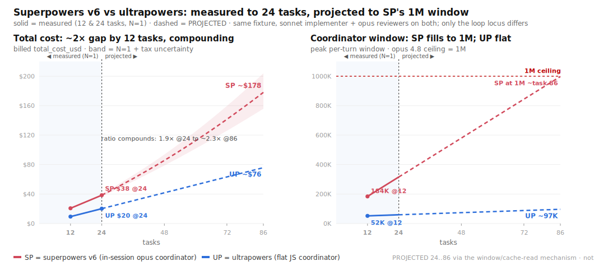

# Ultrapowers

Ultrapowers is a dynamic build workflow for Claude Code. It takes a goal or a task list and builds it for you, unattended: it plans, builds each task
test-first, has a stronger model review every task, loops a critic until the goal is met, and hands
back one reviewed branch. You step in at two points only, approving the plan and reviewing the result.

The build discipline is [Superpowers](https://github.com/obra/superpowers)' work by Jesse Vincent
([@obra](https://github.com/obra)), embedded with gratitude. Ultrapowers' part is the host: it runs
that discipline on a deterministic JavaScript coordinator, so a long, many-task build runs hands-off
without filling up your chat session. The name comes from a Superpowers proposal obra declined; see
[Why it exists](#why-it-exists).

## What you get



Two findings, from a model-fair head-to-head against superpowers v6 (same sonnet implementer and
opus reviewers on both sides; the only structural difference is where the orchestration loop runs):

- **A cost gap that grows with the build.** One task is a tie ($0.76 vs $0.88). By 12 and 24 tasks
  Ultrapowers runs about half the cost ($9.43 vs $20.72 at 12 tasks, $20.19 vs $38.49 at 24), at
  equal quality (both finished every task green). This is N=1 per point and specific to superpowers
  v6, which reworked its reviewer and made its in-session coordinator heavier, so read it as a
  direction and an effect size, not a banked multiple.
- **The coordinator stays flat, and that is the cause.** superpowers runs the loop in your session,
  so its window climbs with every task (measured: a 184K peak window over 201 turns by task 12);
  Ultrapowers runs the loop in a script, so its coordinator holds about 52K across 11 turns and
  barely grows. As the build grows, superpowers' window fills toward the model's 1M ceiling (around
  task 86) while Ultrapowers stays bounded near 100K, so the cost gap compounds from a tie to about
  2.4×; past 1M is forced compaction, which we do not project. Full numbers, the mechanism, and the
  honest projection caveats are in [Benchmarks](#benchmarks-measured-then-projected).

## Quick start

```
/plugin marketplace add 7xuanlu/claude-plugins
/plugin install ultrapowers@7xuanlu
```
Or install this repo directly (it is its own single-plugin marketplace, also named `7xuanlu`):
```
/plugin marketplace add 7xuanlu/ultrapowers
/plugin install ultrapowers@7xuanlu
```
Then:
```
/workflows-driven-development help
/workflows-driven-development "your goal here"
```
The command dispatches the bundled engine directly by `scriptPath`, so it works immediately on a
fresh install — no symlink or by-name registration, and the engine stays out of your slash list.

**Requirements:** Claude Code with the Workflow tool, and Node (the engine is checked on Node 20;
newer is fine). The default implementer (`claude`) needs no external CLI. The optional `codex` and
`gemini` implementers need those CLIs installed plus a sandbox carve-out; see [Safety](#safety-it-runs-code-unattended).

## What it is

Ultrapowers is a Claude Code Workflow (a deterministic JavaScript coordinator) that runs
[Superpowers](https://github.com/obra/superpowers)' SDD/TDD discipline on disposable subagents:

```
goal ─▶ plan
        ⏸ GATE 1: you approve the plan, then walk away
        ─▶ per task (SERIAL):
             implement (cheap model, strict TDD red-green-refactor)
               ─▶ deterministic gate (run the real test suite)
               ─▶ re-witness RED   (strip the impl, prove the test fails without it)
               ─▶ spec review  (capable model, fail-closed, "do not trust the report")
               ─▶ quality review (capable model, fail-closed, YAGNI/anti-gaming)
               ─▶ fix-loop
        ─▶ dry-until-clean critic adds tasks until the goal is met (opt-in)
        ─▶ final adversarial integration review
        ⏸ GATE 2: every finding from the run surfaces to you, before merge
```

The build runs unattended between the two gates. A Workflow takes no mid-run human input, so the
harness never stops to ask. Anything it hits (a failed task, a BLOCKED implementer, gaps the critic
reopened, the integration verdict) is collected and surfaced to you at GATE 2 as a reviewable branch
and a verdict, not a stream of interruptions.

The whole design follows from one fact: **the coordinator is code, not a model turn.**

- **Zero LLM calls in the loop.** The controlling session's context never grows with the build, so
  it cannot compact or overflow; the reasoning happens in subagents.
- **Disposable subagents pay the token cost** once, then are discarded, so heavy context never
  accumulates in your window.
- **Durable state lives in files** (the task list, per-task logs), so the run is crash-resumable and
  is not limited by the controlling session's context.
- **Least-powerful-model routing.** Cheap models implement, capable models review; you do not pay
  top-tier rates for mechanical work.

That is what makes "hand off a whole goal and walk away" actually hold.

## Why it exists

**Most of Ultrapowers is Superpowers, and we do not pretend otherwise.** The build discipline it
runs (watch-it-fail TDD, the merged fail-closed review, least-powerful-model routing) is
Superpowers' work by Jesse Vincent ([@obra](https://github.com/obra)), embedded verbatim, with
gratitude (see [`NOTICE`](./NOTICE)). Expect the same harness guarantees you would get from
Superpowers on everything it covers, no more and no less.

Superpowers is prompt-driven and in-session by design, and obra has been deliberate about it: asked
whether orchestration should move to an external coordinator, he answered that there is *"a ton of
value in external orchestrators, but moving to that model is dramatically more complicated for most
users"* ([#1041](https://github.com/obra/superpowers/issues/1041)). For Superpowers' broad audience
that is the right call, and we respect it.

The name comes from a proposal Superpowers declined:
[#1647](https://github.com/obra/superpowers/issues/1647), *"a new workflow-driven-development
skill-command … the workflow-native sibling of SDD"*, opened by
[@codename-cn](https://github.com/codename-cn) and closed not-planned by obra as an untested,
agent-authored RFC (*"made up by an agent that didn't even test it"*). That critique is the spec:
Ultrapowers is that idea built and tested, hosting the SDD/TDD discipline on Anthropic's
deterministic Workflow primitive, proven by a reproducible re-witness-RED self-test and a measured
benchmark, for the narrower audience that wants to hand off a whole goal and walk away.

So this is complement, not replace: for interactive, human-in-the-loop work use Superpowers, the
parent, which is better at it; Ultrapowers is for unattended hand-offs, where it adds a dynamic
loop-until-clean critic and the mechanical re-witness-RED check. Thanks to
[@obra](https://github.com/obra) for the discipline and a principled decline, and to
[@codename-cn](https://github.com/codename-cn) for the original idea.

**What is ours, and what is not.** The flat coordinator is a property of Anthropic's Workflow
primitive, not our invention; our move is choosing to host SDD/TDD on it. It is a scaling
property: at small sizes the bill is a tie (the N=5 two-task head-to-head was $3.90 vs $4.03 median,
ranges overlap; one task under superpowers v6 is $0.76 vs $0.88), and a dollar gap emerges as tasks
accumulate (about 2× by 12 to 24 tasks against superpowers v6, N=1). Dynamic task-adding critics already exist (CAMEL Workforce,
Magentic-One); ours is novel only in this combination. re-witness RED is the one mechanism we could
not find shipped in any comparable build loop, and it is the headline. The SDD/TDD discipline is
inherited. Detail and sources are in [`docs/research/oss-landscape.md`](./docs/research/oss-landscape.md).

## Where it fits

Ultrapowers takes a goal or a plan and gives back a reviewed branch. The plan can come from
anywhere: a Superpowers brainstorming and writing-plans session, some other planning tool, or a raw
goal you hand it and let it decompose.

```
any goal or plan ─▶ UP /workflows-driven-development ─▶ reviewed branch + GATE 2 verdict ─▶ your merge step
 (e.g. SP brainstorming      (build it, unattended,                                           (e.g. SP
  + writing-plans)            until the goal is met)                                          finishing-a-branch)
```

It begins where you would otherwise reach for `superpowers:subagent-driven-development`: same plan, same
discipline, but on a flat coordinator, so a long, many-task build does not grow the controlling
session. Superpowers is one
good front end (its interactive friction is load-bearing) and `superpowers:finishing-a-development-branch` is one good way
to take the output to merge, but neither is required.

## Benchmarks: measured, then projected

The figure at the top of this README is a re-run of the head-to-head against **superpowers v6**, on
one task axis split at a task-24 cutoff. Solid lines are measured (an N=1 ladder at 12 and 24 tasks,
billed `total_cost_usd`); past the cutoff the dashed lines are a projection. The arms are model-fair
(same sonnet implementer, same opus reviewers; the only structural difference is where the loop
runs). Source and full methodology:
[`docs/benchmarks/cost-and-context-ladder-2026-06-17.md`](./docs/benchmarks/cost-and-context-ladder-2026-06-17.md).

Measured (N=1 per point, same fixture and models on both arms):

- Cost is a tie at one task ($0.76 vs $0.88), then about 2× by 12 and 24 tasks ($9.43 vs $20.72,
  then $20.19 vs $38.49), at equal quality (every task green; Ultrapowers wrote slightly more
  tests). In the earlier v5 run this same 24-task point was a tie ($25.95 vs $28.19). superpowers v6
  reworked its reviewer and added a whole-branch final review, which made its in-session coordinator
  heavier (opus cache-read rose 14.08M to 26.6M at 24 tasks, +89%) while Ultrapowers' fell (4.91M to
  2.5M, -49%). N=1 per point, so this is a direction and an effect size, not a banked ratio.
- The mechanism: superpowers' in-session coordinator grew to a 184K peak window over 201 turns by
  task 12; Ultrapowers' script coordinator held 52K across 11 turns. That re-read is the cost, the
  opus coordinator line is about 88% of superpowers' bill.

Projected (24 to 86 tasks, stopping at the 1M window): a long goal accumulates context in
superpowers' in-session coordinator, which is re-read every turn (a cache-read tax that compounds as
the window grows) until it reaches the opus 1M ceiling around task 86; Ultrapowers' coordinator is
bounded, so its cost stays about linear. We stop the projection at that ceiling rather than model the
forced-compaction regime beyond it. Extrapolating the measured mechanism:

| tasks | SP window | SP cost | UP cost | ratio |
|--:|--:|--:|--:|--:|
| **12** (measured) | 184K | **$20.72** | **$9.43** | 2.2× |
| **24** (measured) | ~316K | **$38.49** | **$20.19** | 1.9× |
| 48 | ~580K | ~$86 | ~$42 | ~2.1× |
| 72 | ~844K | ~$142 | ~$63 | ~2.2× |
| **86** (SP at 1M) | ~1M | **~$178** | **~$76** | **~2.4×** |

Within that range the gap compounds: as superpowers' window fills from 184K toward 1M, the cost ratio
climbs from 1.9× at 24 tasks to about 2.4× at task 86, while Ultrapowers' coordinator stays bounded
near 100K. Past 1M both arms would compact, which we do not project.

> The dashed region is projected, not measured. It extrapolates an N=1 ladder via the
> window/cache-read mechanism, anchored on the measured window growth (184K over 201 turns at task
> 12) and the measured cache-read (12.44M to 26.6M) rather than on the two noisy cost points (the
> 12-task run ran hot). The band is single-run plus tax uncertainty, about 2.0× to 2.7× at task 86.
> superpowers v6's file-handoff substrate and merged reviewer are real token wins for an in-session
> controller; Ultrapowers gets those same wins on a coordinator that never grows, which is why the
> gap compounds rather than closes. Reproduce or audit the model in
> [`bench/plot-cost-projection-v6.py`](./bench/plot-cost-projection-v6.py) and
> [`docs/benchmarks/cost-and-context-ladder-2026-06-17.md`](./docs/benchmarks/cost-and-context-ladder-2026-06-17.md).

## Safety: it runs code unattended

Ultrapowers writes files, runs your `verifyCmd`, and makes git commits in the target repo across
many disposable subagents, with the human only at the plan-approval and critical-review gates.
Before you run it, read [`SECURITY.md`](./SECURITY.md), the threat model. In short:

- Run it only on code and in a repo you trust, in an isolated worktree or branch (the command
  creates one if you are on `main`). Review the branch before merging.
- `verifyCmd` executes with your permissions. Never point it at untrusted scripts.
- External implementers (`codex` and `gemini`) run unsandboxed and need an explicit allow-list plus a
  sandbox carve-out. The default `claude` implementer does not. Details and rationale are in
  [`SECURITY.md`](./SECURITY.md).

## Roadmap

Ultrapowers runs in Claude Code today, hosted by the Workflow tool. The coordinator is plain
JavaScript and the implementer can already be Claude, Codex, or Gemini, so hosting the coordinator
on other agents is the main open goal, not a promise yet.

## Contributing

Contributions are held to the same bar Ultrapowers enforces on the code it builds: TDD,
re-witness-RED, surgical changes. Start with [`CONTRIBUTING.md`](./CONTRIBUTING.md) and
[`AGENTS.md`](./AGENTS.md) (the agent and operator manual); all participation is under the
[`CODE_OF_CONDUCT.md`](./CODE_OF_CONDUCT.md) (Contributor Covenant).

## License

Ultrapowers is [MIT](./LICENSE). Per that license, the source of the embedded discipline is
credited: it embeds verbatim MIT-licensed text from Superpowers (Copyright 2025 Jesse Vincent),
whose license is reproduced in [`LICENSE-superpowers`](./LICENSE-superpowers) and whose embedded
files are enumerated in [`NOTICE`](./NOTICE).

## Community

- Questions, bugs, and ideas: [open an issue](https://github.com/7xuanlu/ultrapowers/issues).
- Ultrapowers stands on Superpowers. If it helps you, please consider
  [sponsoring obra's open-source work](https://github.com/sponsors/obra).
