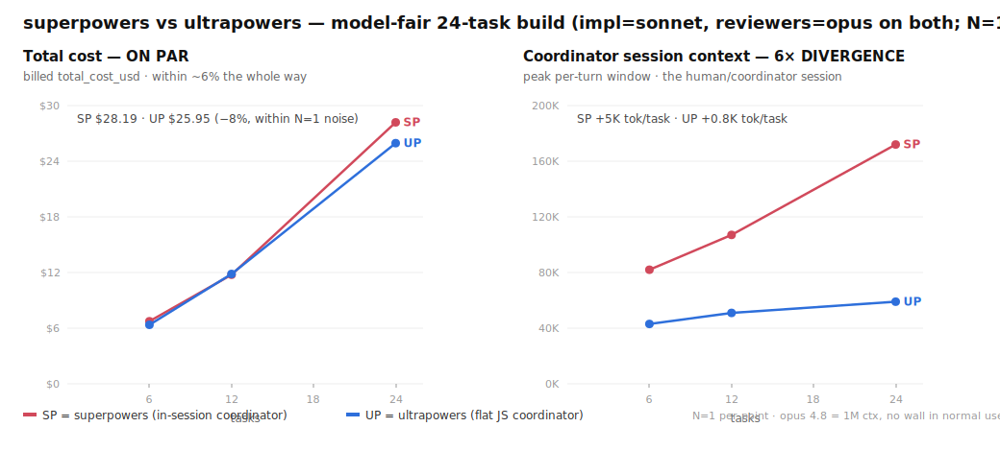

# ultrapowers

**Unattended, flat-coordinator SDD/TDD build harness for Claude Code.** Hand it a goal or a
task list; it plans, builds each task under strict TDD, reviews every task with a separate
capable model, loops a critic until the goal is satisfied, and gates the whole change behind
a final adversarial review — with the human only at plan-approval and critical-review gates.

> **Status: alpha.** One developer's tool, hardening in the open. Expect sharp edges.

---

## What it is

ultrapowers is a Claude Code **Workflow** (a deterministic JavaScript coordinator) that runs
[Superpowers](https://github.com/obra/superpowers)' SDD/TDD discipline on disposable subagents:

```
goal ─▶ plan ─▶ per task (SERIAL):
                  implement (cheap model, strict TDD red-green-refactor)
                    ─▶ deterministic gate (run the real test suite)
                    ─▶ re-witness RED   (strip the impl, prove the test fails without it)
                    ─▶ spec review  (capable model, fail-closed, "do not trust the report")
                    ─▶ quality review (capable model, fail-closed, YAGNI/anti-gaming)
                    ─▶ fix-loop
               ─▶ dry-until-clean critic adds tasks until the goal is met
               ─▶ final adversarial integration review (gates merge)
```

Because the coordinator is a script (not an LLM turn), the **main session's context stays
flat** for the whole run — only the final result lands in your window. The work tokens are
paid by disposable subagents, which run on cheap, role-routed models.

## Why it exists (and how it relates to Superpowers)

ultrapowers stands on **Superpowers** by Jesse Vincent ([@obra](https://github.com/obra)).
Its discipline — watch-it-fail TDD, two-stage fail-closed review, least-powerful-model
routing — is Superpowers', adopted **verbatim**, with gratitude. See [`NOTICE`](./NOTICE).

Superpowers is, by design, **prompt-driven and in-session**. Its maintainer has deliberately
declined moving orchestration to an external coordinator — *"there is a ton of value in
external orchestrators, but moving to that model is dramatically more complicated for most
users"* ([#1041](https://github.com/obra/superpowers/issues/1041)) — and closed the
dynamic-workflow proposal as not-planned ([#1647](https://github.com/obra/superpowers/issues/1647)).
That is the right call for Superpowers' audience, and we respect it.

ultrapowers serves the *other* audience: people who want to hand off a **whole goal and walk
away** — long, unattended builds. It takes the path Superpowers declined: hosting
that discipline on Anthropic's deterministic **Workflow** primitive (so the coordinator's
context stays flat and the run survives arbitrarily long), and adds two things Superpowers
doesn't ship: a **dynamic loop-until-clean critic** and a **mechanical re-witness-RED**
test-integrity check.

**Honest scope of the contribution** (see [`docs/research/oss-landscape.md`](./docs/research/oss-landscape.md)):
- The **flat coordinator** is a property of Anthropic's Workflow primitive — **not our invention**.
  Our contribution is *choosing to host SDD/TDD on it*, which Superpowers structurally won't.
  This is a **scaling/capability** property, not a cost discount: on a measured head-to-head
  (N=5, two small tasks/run) total cost was a **tie** — $3.90 vs $4.03 median, ranges fully
  overlap (`[V docs/benchmarks/campaign-n5-2026-06-14.md]`). The flat coordinator pays off on
  **long/many-task builds**, where Superpowers' in-session controller grows until it overflows
  the model's context window and must compact or fail — not as a per-bill saving at normal sizes.
- Dynamic task-adding critics already exist elsewhere (CAMEL Workforce, Magentic-One). Novel
  only *in this combination*.
- **re-witness RED** is the one mechanism we could not find shipped in any comparable build
  loop. It's the headline.
- The SDD/TDD discipline is **inherited**, not invented.

**If you want interactive, human-in-the-loop development, use Superpowers** — it's the parent
and it's better at that. ultrapowers is for unattended hand-offs.

## Measured: cost on par, coordinator context 6× flatter

Model-fair head-to-head — **same** implementer (sonnet) and reviewers (opus) on both arms;
the *only* structural difference is where the orchestration loop lives. 24-task build, billed
`total_cost_usd`. (`[V docs/benchmarks/cost-and-context-ladder-2026-06-14.md]`, `/council`-reviewed.)



**The two numbers for users:**

- **Total cost is on par** — within ~6% the whole way to 24 tasks ($25.95 vs $28.19; the 12-task
  point even *reverses*), at **equal quality** (both 24/24 tasks green; ultrapowers wrote 192 tests
  vs 145). There is **no per-bill discount** at normal sizes.
- **The coordinator's session context grows ~6× slower** — **0.8K vs 5K tokens/task** (at 24 tasks,
  59K vs 172K). superpowers runs the loop *in-session*, so its context climbs with every task;
  ultrapowers' coordinator is a script, so its session only carries the task list in and the result
  out — the build adds nothing.

**What this means:** on a 1M-context coordinator (opus 4.8 / sonnet 4.6) **neither arm walls in
normal use** — so at realistic sizes this is a *tie* you'd pick on features, not cost. ultrapowers'
flat coordinator is **headroom**: a bounded, predictable session that survives very long autonomous
runs (where superpowers' in-session controller eventually approaches the 1M ceiling ~task 180 and
must compact) and keeps *your* window clear. N=1 per point — these locate the shape, not a CI.

## Projected at scale: where the flat coordinator becomes a cost win

Parity holds at normal sizes. But a *single long-running goal* — the case ultrapowers is built
for — runs for hundreds of tasks, and there the architectures diverge. superpowers' coordinator
window grows every task and is **re-read by the model on every turn** (a cache-read tax that grows
with the window); ultrapowers' coordinator is bounded, so its cost stays ~linear. Extrapolating the
measured ladder by that mechanism, up to where superpowers' coordinator approaches its 1M ceiling:


| tasks | SP window | **SP cost** | **UP cost** | ratio |
|--:|--:|--:|--:|--:|
| **24** (measured) | 172K | **$28.19** | **$25.95** | 1.09× |
| 48 | 292K | ~$64 | ~$53 | 1.21× |
| 96 | 532K | ~$158 | ~$110 | 1.44× |
| 144 | 772K | ~$282 | ~$171 | 1.65× |
| **~180** (SP nears 1M) | ~950K | **~$395** | **~$219** | **~1.8×** |

**Projected headline:** by the time superpowers' coordinator fills toward 1M (~task 180 in one
hand-off), ultrapowers runs it for **~$219 vs ~$395 — roughly 1.8× / ~$175 / ~45% cheaper.** UP's
coordinator at that point is still ~188K (bounded; never walls).

> **This is PROJECTED, not measured — honest disclosure.** It is an extrapolation from an **N=1**
> ladder via the cache-read-tax mechanism; the band on the plot is the single-run uncertainty
> (~1.3×–2.4× at task 180, central 1.8×). The clean *measured* signal is the window-growth rate
> (5K vs 0.8K tok/task); the dollar curve rides on it. It is **sizable, not "massive"** — a 3×+ gap
> would only appear *past* the 1M wall, in superpowers' forced-compaction regime, which we do **not**
> model. Reproduce/audit the model in [`bench/plot-cost-projection.py`](./bench/plot-cost-projection.py)
> and [`docs/benchmarks/cost-and-context-ladder-2026-06-14.md`](./docs/benchmarks/cost-and-context-ladder-2026-06-14.md).

## Install

```
/plugin marketplace add 7xuanlu/claude-plugins
/plugin install ultrapowers@7xuanlu
```
Or install this repo directly (it is its own single-plugin marketplace):
```
/plugin marketplace add 7xuanlu/ultrapowers
/plugin install ultrapowers@ultrapowers
```
Start a new session so the SessionStart hook runs — it symlinks the engine into
`~/.claude/workflows/ultrapowers-development.js`. Then:
```
/workflows-driven-development help
```
If the command does not resolve by name in a freshly-installed session, it falls back to
dispatching the engine by `scriptPath` automatically (see the command's dispatch fallback).

**Requirements:** Claude Code with the Workflow tool, and Node (the engine is checked on Node 20;
newer is fine). The default implementer (`claude`) needs no external CLI. The optional `codex` /
`gemini` implementers require those CLIs installed plus a sandbox carve-out — see **Safety** below.

## Safety — it runs code unattended

ultrapowers **writes files, runs your `verifyCmd`, and makes git commits** in the target repo
across many disposable subagents, with the human only at plan-approval and critical-review gates.
Before you run it, read **[`SECURITY.md`](./SECURITY.md)** — it is the threat model. In short:

- **Run it only on code and in a repo you trust**, in an isolated worktree/branch (the command
  creates one if you're on `main`). Review the branch before merging.
- **`verifyCmd` executes with your permissions** — never point it at untrusted scripts.
- **External implementers (`codex`/`gemini`) run unsandboxed** and need an explicit allow-list +
  sandbox carve-out. The default `claude` implementer does not. Details and rationale in
  [`SECURITY.md`](./SECURITY.md).

## Layout

| path | what |
|------|------|
| `.claude-plugin/` | `plugin.json` + `marketplace.json` — installable plugin manifests |
| `commands/workflows-driven-development.md` | the `/workflows-driven-development` command (user-only; owns the human gates) |
| `workflow/ultrapowers-development.js` | the harness (the deterministic coordinator) |
| `hooks/` | SessionStart hook — symlinks the engine into `~/.claude/workflows/` |
| `reference/` | load-on-demand command docs (task-list, harness, re-witness-red, gating) |
| `docs/decisions/` | architecture decision records |
| `docs/research/oss-landscape.md` | competitive / novelty analysis (evidence-tagged) |
| `docs/benchmarks/token-benchmark.md` | token-cost model + measured results |
| `tests/re-witness-red/` | reproducible proof of the re-witness-RED catch path |
| `docs/DISCUSSION.md` | running design log / open questions |

## License

ultrapowers is [MIT](./LICENSE). It embeds verbatim MIT-licensed text from Superpowers
(© 2025 Jesse Vincent); that license is reproduced in [`LICENSE-superpowers`](./LICENSE-superpowers)
and the embedding is documented in [`NOTICE`](./NOTICE).
